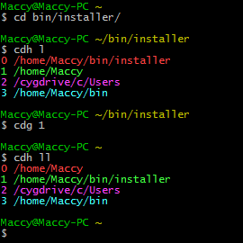

Shell
=====

Standard bash shell setup compatible with cygwin - I can't work without directory history in particular.

See below image for example of directory history





Note that there is no limit to the directory history - _extremely_ useful for grepping and grabbing paths.


# Features
cdh - Most recently used directories. ```cdh l``` - lists the directory. ```cdh 23``` opens directory 23rd MRU directory from list. ```cdh ll``` lists all recorded directories MRU.

f - ```find . -iname``` expander

fxg - ```find . -iname "" | xargs grep -In ""``` expander e.g. fxg "\*.c" "struct name"

g - ``` grep -Irni "" .``` expander e.g. g "a search"

mvim - Open grep search results in vim one by one (paste in results from g)

n - Number outputs of command e.g. ```grep -Irni "A search" | n```

nr - Pick from the output e.g. ```vim `nr 11` ```

v - Vim expander for grep results e.g. accepts file.c:23:


#Installation

Copy to ~/bin directory then go into installer directory and run ```bash install.sh```
